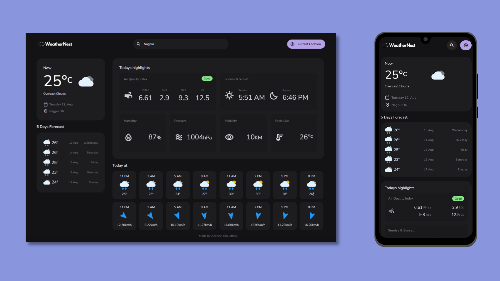
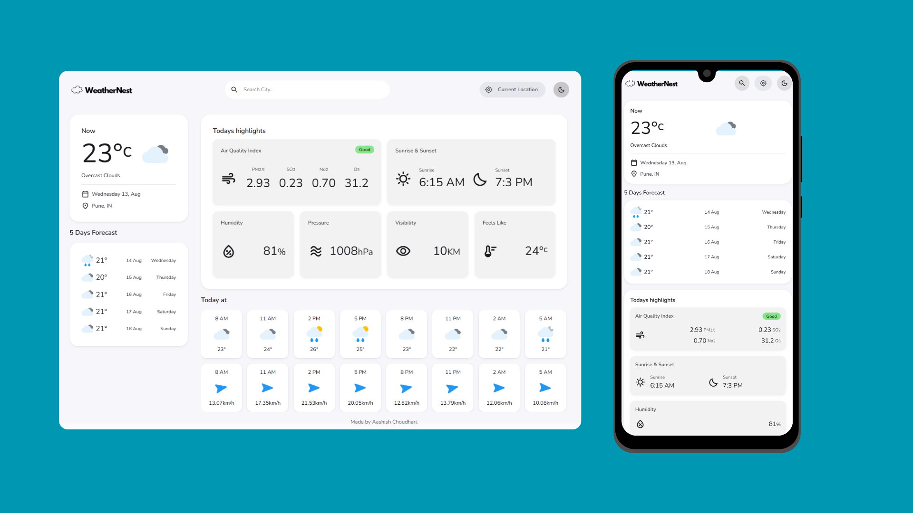

# WeatherNest

A simple weather web app built with HTML, CSS, and vanilla JavaScript. It uses the OpenWeather API.

## Screenshot
Dark mode

Light mode


## Features

- Current weather, hourly and 5-day forecast
- Air quality (AQI)
- City search with debounce
- Mobile-friendly responsive UI

## Tech stack

- HTML, CSS, JavaScript (ES modules)
- OpenWeather REST API

## How to run
1) Clone:

```bash
git clone https://github.com/ashish-choudhari-git/WeatherNest.git
```

2) Put your API key in this file (don’t commit this file to the repo):
   - File: `assets/js/config.js`
   - Variable:

     ```javascript
     window.OPENWEATHER_API_KEY = "YOUR_OPENWEATHER_API_KEY";
     ```

   Make sure `index.html` loads `config.js` before `assets/js/api.js`:

   ```html
   <script src="assets/js/config.js"></script>
   <script type="module" src="assets/js/api.js"></script>
   <script type="module" src="assets/js/app.js"></script>
   ```


## Credits

The design of this project was heavily inspired by codewithsadee. However, majority the code was written independently without copying any of their code. I mainly took inspiration from the design, way of coding and implemented it with my own code.